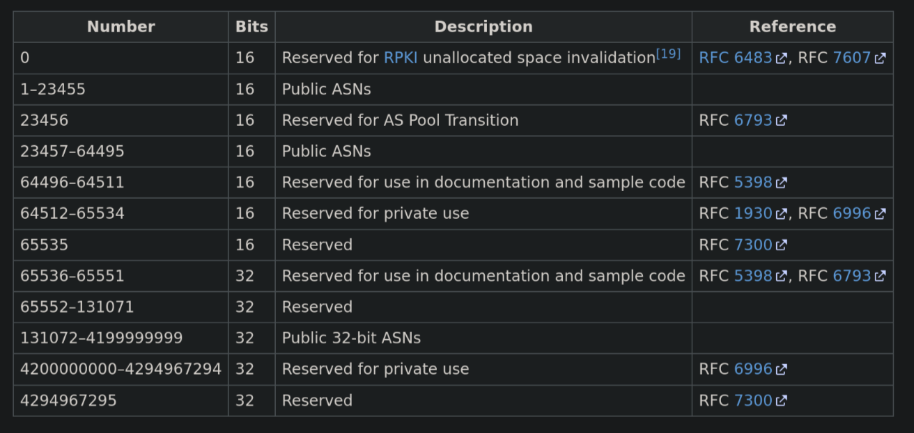
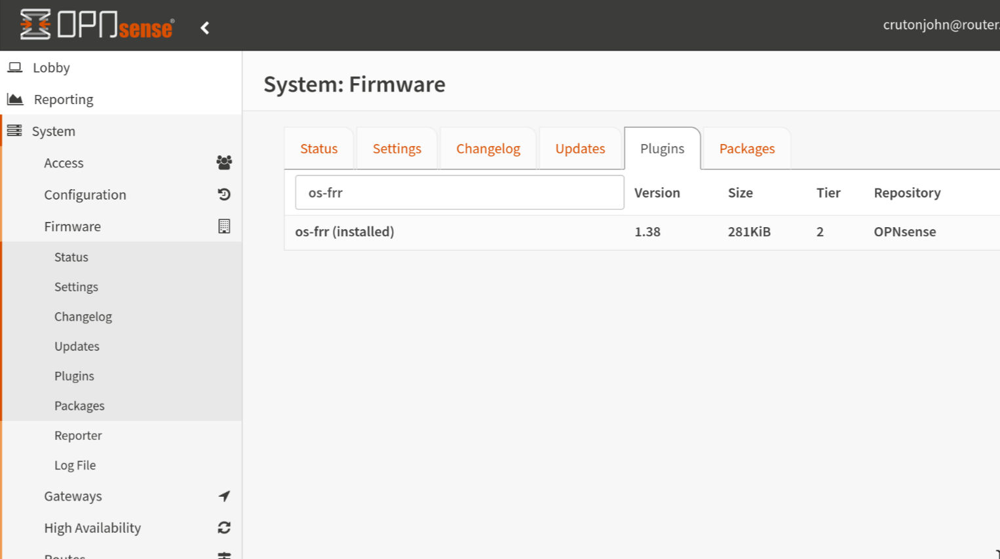
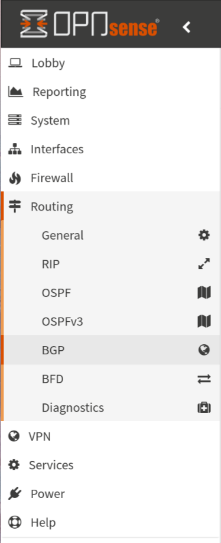
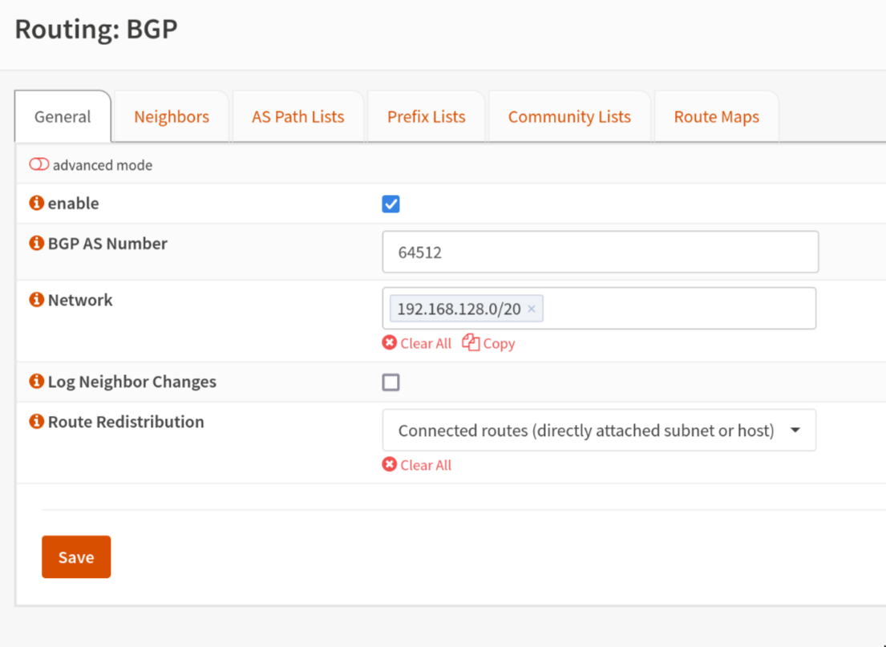
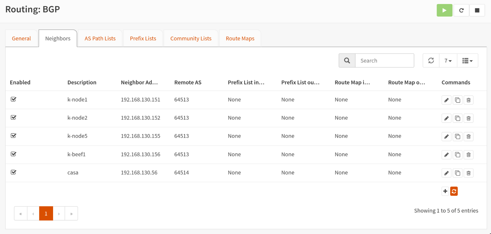
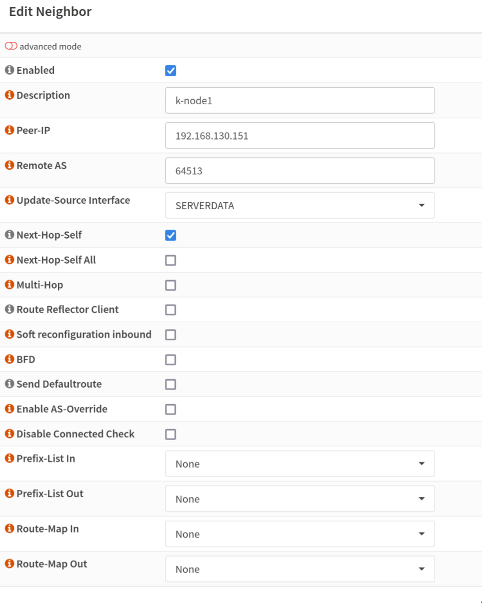

## Intro

This post has some narrative at the beginning that you may not care for so feel free to skip to the guide section if you just want the meat and potatoes. It's also worth noting that I do get a bit granular at times with explanations to provide some extra context so if you're looking for a drive-by copy/paste you may not like it. Sorry!


### Non-technical backstory

> Feel free to skip this section if you don't like backstory and hate narratives

After we finished up playing Palworld my wife was looking for another game to scratch the itch of survival-game-meets-animal-taming. Years and years ago my friends and I were obsessed with Ark Survival Evolved, so we decided that would be our next game since she had never played it. So then it was on to establishing a server for us and some friends to play. After a few bad justifications to purchase new hardware for a Kubernetes "gaming node" we were off to tame dinosaurs -- or so we thought. Netorking issues plagued our gaming sessions. Every 20-40 minutes everyone would lag for about 30 seconds and rubber-band.

### Technical backstory

> This is probably the section you're more interested in

My initial LoadBalancer setup was pretty run-of-the-mill for most lab scenarios. I was using the ever present [MetalLB](https://metallb.universe.tf/) in [Layer 2 mode](https://metallb.universe.tf/concepts/layer2/) wired together with [Cilium](https://cilium.io/). Roughly speaking MetalLB in Layer 2 mode uses something called [Address Resolution Protocol aka ARP](https://en.wikipedia.org/wiki/Address_Resolution_Protocol) in order to get network traffic to your LoadBalancer. Without going into too much detail the Speaker pod running inside your cluster (utilizing host networking) sends out a GARP (Gratuitous ARP) over the L2 network effectively saying *"if someone is looking for **LoadBalancer IP** you can find it at **MAC address of k8s node**"*. That request is stored in your router's ARP table, transparently sending your traffic to your cluster. Again, this is all pretty bog standard for most homelabs and works pretty well! I was able to use this to host a many number of things for quite a while. Unfortunately the cracks began to show when I started hosting game servers.

I have no collected evidence to substantiate this but I had a sneaking suspicion that something was going on with MetalLB. After many hours of chasing down phantom lag spikes and strange behavior I decided to try a troubleshooting step in ditching MetalLB altogether for a more reliable routing solution: Border Gateway Protocol. Aside from the humorous and entertaining nickname of ["Two-Napkin Protocol"](https://computerhistory.org/blog/the-two-napkin-protocol/), BGP is an extremely powerful networking protocol that legitimately drives the entire internet at large. If you haven't read up on it I highly recommend it. To skip ahead a little, this basically solved all of my lag problems.

Now let's get into the "guide" part of this post, shall we?


## Guide

### Pre-Requisites

- Opnsense
  - `os-frr` plugin installed
- Kubernetes
  - Cilium (installed with Helm)
- Knowledge of _your_ IPAM (IP Address Management) model

### Information Gathering

Before we edit anything you'll want to get a few vital pieces of information. For starters you'll need to determine what set of IPs you want to use for your LoadBalancers. Due to some other things going on in my network setup I am allocated `192.168.128.0/20` to use as I please. I have split this up into several VLANs sequentially on the third octet like: `x.x.128.0/24`, `x.x.129.0/24`, and so on. I chose to use one of my unused subnets, `192.168.142.0/24`. You could also use a smaller range if you don't need to accomodate a ton of LoadBalancers like `x.x.x.x/28`. If you need help with figuring out CIDR notations or subdividing existing networks check out [this CIDR/VLSM calculator](https://www.subnet-calculator.com/cidr.php) that I use quite often. Whatever you decide on just **make sure this range is not already in use somewhere else on your LAN**.

Additionally you'll need to decide on your [AS Number](https://en.wikipedia.org/wiki/Autonomous_system_(Internet)). I know this might be intimidating and confusing at first if you don't know how this stuff works. In layman's terms, AS numbers are kinda like identifiers for networks. For example AWS has AS16509. AWS will advertise all of their various public IPv4 networks to large internet exchanges by saying "I am AS16509, and I will accept traffic directed towards the following IPv4/6 routes". When you get a few of these ASNs peered together you begin to see how the internet functions at large. Anyways, similar to IPv4 addresses having public and private addresses, there are public and private ASNs. Furthermore like IPv4 there are a limited amount of ASNs. Here is a table that shows what the ASNs are for:



You'll want to pick two different ASNs in the `64512–65534` range, one for Opnsense and one for your cluster. I picked `64512` for Opnsense and `64513` for my cluster. If you're doing more than one cluster it might even be beneficial to use different ASNs for each cluster, but I'm still working that bit out.

Ok, just to be totally clear (cause that was kinda dense) these are my values:

|          | ASN   | CIDR             |
|----------|-------|------------------|
| Opnsense | 64512 | |
| Cluster  | 64513 | 192.168.142.0/24 |

### Setting up Opnsense

#### Install `os-frr`

Log into Opnsense and install the `os-frr` plugin if you haven't already.



This is how we're going to get BGP running on the router. Once you have the plugin installed, refresh the webpage.

> `os-frr` is [Free Range Routing](https://github.com/FRRouting/frr) which is an open-source routing software suite for Unix platforms

#### Initialize BGP Settings

Now we can navigate in the sidebar to the `Routing > BGP` section:



Firstly, we'll fill in the AS number that we selected for Opnsense to use. You should be able to ignore the `Networks` section because that's specific to my setup. Additionally check the box to enable BGP and click "Save".



#### Declaing BGP Peers/Neighbors

Next we will tell our router to accept BGP requests from our Kubernetes nodes. Navigate to the "Neighbors" tab. Click the little "+" button at the bottom to start defining your Kubernetes nodes.



When you are defining your nodes, be sure to check the `Enabled` and `Next-Hop-Self` boxes. Enter your node's IP and the ASN you selected for your cluster. `Update-Source-Interface` should be set to the interface that acts as the Gateway for your Kubernetes nodes. Repeat this process for all of the nodes in your cluster until you have them all added.



That's it! Your router is ready to BGP peer with your Kubernetes nodes. Next we'll move on to getting Cilium configured.

### Cilium BGP Control Plane

[Cilium BGP Control Plane](https://docs.cilium.io/en/stable/network/bgp-control-plane/) is a relatively new addition to the Cilium "suite". While they have supported BGP previously, it was in [tandem with MetalLB](https://docs.cilium.io/en/stable/network/bgp/), whereas the new BGP Control Plane stands up on its own. It is the mechanism by which we will be able to provision LoadBalancers in our Kubernetes cluster. Enough backstory lets dig in.

#### Installing/Upgrading Cilium Helm Release

Make sure you have `helm` installed. You can check out how to do that for you machine [here](https://helm.sh/docs/intro/install/).

Now add the Cilium helm repo:

```
helm repo add cilium https://helm.cilium.io/
```

If you haven't previously installed Cilium, I'd encourage you to stop here and get some experience with that first. There are a lot of options in the Helm chart and the options are too exhaustive to detail here. The values that we are focused on are the BGP Control Plane ones. More specifically:

```yaml
bgpControlPlane:
    enabled: true
```
Once you have that set, it should be as simple as:

```
helm upgrade cilium cilium/cilium -f your_values.yaml
```
For the sake of completeness here is my values file in its entirety. You can ignore most of the `clustermesh` related settings (maybe I'll cover that in a different post?)

```yaml
cluster:
    id: 1
    name: production
k8sServiceHost: 192.168.130.154 # this should be your k8s api server
k8sServicePort: 6443 # this should be your k8s api server port
kubeProxyReplacement: strict
l7Proxy: false
l2announcements:
    enabled: true
loadBalancer:
    algorithm: maglev
devices: enp1s0 # this should be the name of the network device that your k8s node(s) are using. yes, it has to be the same on all nodes.
bgpControlPlane:
    enabled: true # this is required for the BGP exercise to work!!
externalIPs:
    enabled: true
bpf:
    masquerade: true
cni:
    exclusive: false
hubble:
    enabled: true
    metrics:
        enabled:
            - dns:query;ignoreAAAA
            - drop
            - tcp
            - flow
            - port-distribution
            - icmp
            - http
        serviceMonitor:
            enabled: false
    relay:
        enabled: true
        rollOutPods: true
        prometheus:
            serviceMonitor:
                enabled: false
    ui:
        enabled: true
        rollOutPods: true
        ingress:
            enabled: false
ipam:
    mode: kubernetes
operator:
    replicas: 1
    rollOutPods: true
    prometheus:
        enabled: true
        serviceMonitor:
            enabled: false
prometheus:
    enabled: true
    serviceMonitor:
        enabled: false
rollOutCiliumPods: true
encryption:
    enabled: true
    type: wireguard
    nodeEncryption: false
egressGateway:
    enabled: false
serviceAccounts:
    cilium:
        name: cilium
    operator:
        name: cilium-operator
tls:
    ca:
        cert: <cert things>
        key: <key things>
clustermesh:
    useAPIServer: true
    maxConnectedClusters: 255
    config:
        enabled: true
        domain: mesh.cilium.io
        clusters:
            - name: home-automation
              address: home-automation.mesh.cilium.io
              port: 32002
              ips:
                - 192.168.130.56
              tls:
                cert: <cert things>
                key: <key things>
                caCert: <cert things>
    apiserver:
        kvstoremesh:
            enabled: true
        service:
            type: NodePort
            nodePort: 32001
            externalTrafficPolicy: Cluster
            internalTrafficPolicy: Cluster
        tls:
            authMode: legacy
            auto:
                enabled: true
                method: cronJob
                certValidityDuration: 1095
            server:
                cert: ""
                key: ""
            admin:
                cert: ""
                key: ""
            client:
                cert: ""
                key: ""
            remote:
                cert: ""
                key: ""
```

#### Cilium BGP Settings

Ok, so we have Cilium configured to utilize BGP but we still need to feed it the ASN and subnet we decided on before. The configuration for the Cilium BGP Control Plane is driven by Custom Resource Definitions. You ought to be able to take these two CRD YAML files and plug in your ASN/Subnet.

##### CiliumLoadBalancerIPPool

This is pretty self-explanitory. We are telling Cilium that it can assign LoadBalancer addresses from this pool of IPs. Technically speaking you can also define a range of IP addresses instead of a full CIDR, but I will leave that exercise up to the reader.

```yaml
---
apiVersion: cilium.io/v2alpha1
kind: CiliumLoadBalancerIPPool
metadata:
  name: service-pool
spec:
  cidrs:
    - cidr: 192.168.142.0/24 # change this!
```

##### CiliumBGPPeeringPolicy

This is the bulk of the configuration for Cilium's BGP settings. The way that my example is written it will apply this policy to nodes with the label `io.cilium/bgp=worker`. Furthermore it will only allow LoadBalancer definitions with the label `io.cilium/bgp-announce=worker`. Of course these can be changed to fit your deployment scenario. ~~You could also outright remove the `nodeSelector` and `serviceSelector` sections to allow Cilium to control every LoadBalancer in your cluster.~~

> Correction as per [JJGadgets](https://jjgadgets.tech/):
> While `nodeSelector` is not required, `serviceSelector` _is_. His suggestion is to use `NotIn` [as seen in his repo](https://github.com/JJGadgets/Biohazard/blob/3f9086de48e136053ad1ac1043db403c554707ac/kube/deploy/core/_networking/cilium/loadbalancer/BGP.yaml#L17-L19) in the event that you want to select all `LoadBalancer` services.
> As always, you can run `kubectl explain` to help you figure out what different fields are for in a given Kubernetes resource.

```
❯  kubectl explain ciliumbgppeeringpolicy.spec.virtualRouters
GROUP:      cilium.io
KIND:       CiliumBGPPeeringPolicy
VERSION:    v2alpha1

FIELD: virtualRouters <[]Object>

DESCRIPTION:
    A list of CiliumBGPVirtualRouter(s) which instructs the BGP control plane
    how to instantiate virtual BGP routers.
    CiliumBGPVirtualRouter defines a discrete BGP virtual router configuration.

FIELDS:
  exportPodCIDR	<boolean>
    ExportPodCIDR determines whether to export the Node's private CIDR block to
    the configured neighbors.

  localASN	<integer> -required-
    LocalASN is the ASN of this virtual router. Supports extended 32bit ASNs

  neighbors	<[]Object> -required-
    Neighbors is a list of neighboring BGP peers for this virtual router

  podIPPoolSelector	<Object>
    PodIPPoolSelector selects CiliumPodIPPools based on labels. The virtual
    router will announce allocated CIDRs of matching CiliumPodIPPools.
     If empty / nil no CiliumPodIPPools will be announced.

  serviceSelector	<Object>
    ServiceSelector selects a group of load balancer services which this virtual
    router will announce. The loadBalancerClass for a service must be nil or
    specify a class supported by Cilium, e.g. "io.cilium/bgp-control-plane".
    Refer to the following document for additional details regarding load
    balancer classes:
     https://kubernetes.io/docs/concepts/services-networking/service/#load-balancer-class
     If empty / nil no services will be announced.
```

```yaml
---
apiVersion: cilium.io/v2alpha1
kind: CiliumBGPPeeringPolicy
metadata:
  name: bgp-peering-policy-worker
spec:
  nodeSelector: # Delete this line to apply this policy to all cluster members
    matchLabels: # Delete this line to apply this policy to all cluster members
      io.cilium/bgp: worker # Delete this line to apply this policy to all cluster members
  virtualRouters:
    - localASN: 64513 # Use your cluster's ASN here!
      serviceSelector: # Delete this line to allow all LoadBalancers
        matchExpressions: # Delete this line to allow all LoadBalancers
          - {key: "io.cilium/bgp-announce", operator: NotIn, values: ['fakevalue']} # This will allow all `LoadBalancers`
      neighbors:
        - peerAddress: '192.168.130.1/32' # This should be the IP of your Opnsense Router, the /32 should be included as CIDR notation is required.
          peerASN: 64512 # Set this to the ASN delegated to your Opnsense Router
          eBGPMultihopTTL: 10
          connectRetryTimeSeconds: 120
          holdTimeSeconds: 90
          keepAliveTimeSeconds: 30
          gracefulRestart:
            enabled: true
            restartTimeSeconds: 120
```

That's truly it! You should absolutely move on to testing this out.

### Provisioning Your First LoadBalancer with BGP

Navigate to [this Cilium docs page](https://docs.cilium.io/en/v1.15/network/bgp/#create-loadbalancer-and-backend-pods) to find a very basic nginx and LoadBalancer deployment YAML. Here, I'll save you a click if you used my example `CiliumBGPPeeringPolicy`:

```yaml
---
apiVersion: v1
kind: Service
metadata:
  name: test-lb
  labels:
    io.cilium/bgp-announce: worker
spec:
  type: LoadBalancer
  ports:
  - port: 80
    targetPort: 80
    protocol: TCP
    name: http
  selector:
    svc: test-lb
---
apiVersion: apps/v1
kind: Deployment
metadata:
  name: nginx
spec:
  selector:
    matchLabels:
      svc: test-lb
  template:
    metadata:
      labels:
        svc: test-lb
    spec:
      containers:
      - name: web
        image: nginx
        imagePullPolicy: IfNotPresent
        ports:
        - containerPort: 80
        readinessProbe:
          httpGet:
            path: /
            port: 80
```

Cilium will automatically pick an IP for you out of the supplied range defined in your `CiliumLoadBalancerIPPool`. Chances are that if you haven't deployed anything yet, it'll be the first available IP in your provided range. In the example pool it'll be `192.168.142.1`. Once you have applied that nginx and service to your cluster you should be able to navigate to the IP delegated to your service and viola! A wild nginx page will appear!

## Conclusion

I may never know the reason why this worked and fixed all of my lag problems, but I will get to play video games without lagging...so I think I'm the real winner here. I was happy that I was able to get this done and understood well enough to send some good vibes and knowledge back into the world. Hopefully this helps you ditch weak and puny L2 load balancing for the Chad load balancing that is BGP. Congrats, you're basically CCNA certified now or whatever.

## Sources & Helpful Links

- https://docs.cilium.io/en/v1.15/network/bgp-control-plane/
- https://docs.cilium.io/en/v1.15/network/bgp-control-plane/#cilium-agent-cli
- https://kubernetes.io/docs/concepts/services-networking/service/#loadbalancer
- https://en.wikipedia.org/wiki/Autonomous_system_(Internet)

## Acknowledgements

- As always, I would not have been able to do any of this without the helpful people in the [Home Operations discord server](https://discord.com/invite/RGvKzVg).
- Simon from [DickingWithDocker](https://dickingwithdocker.com/). I wanted a more lengthy guide so I remixed their two posts on the topic into a single post with my own snark and detail:
  - https://dickingwithdocker.com/posts/using-bgp-to-integrate-cilium-with-opnsense/
  - https://dickingwithdocker.com/posts/update-using-bgp-to-integrate-cilium-with-opnsense/
- Tyzbit's [guide on BGP with Calico](https://tyzbit.blog/configuring-bgp-with-calico-on-k8s-and-opnsense) that helped me mind-map some concepts out
- [JJGadgets's](https://jjgadgets.tech/) corrections! Thank you for pointing out my dumb mistakes.

